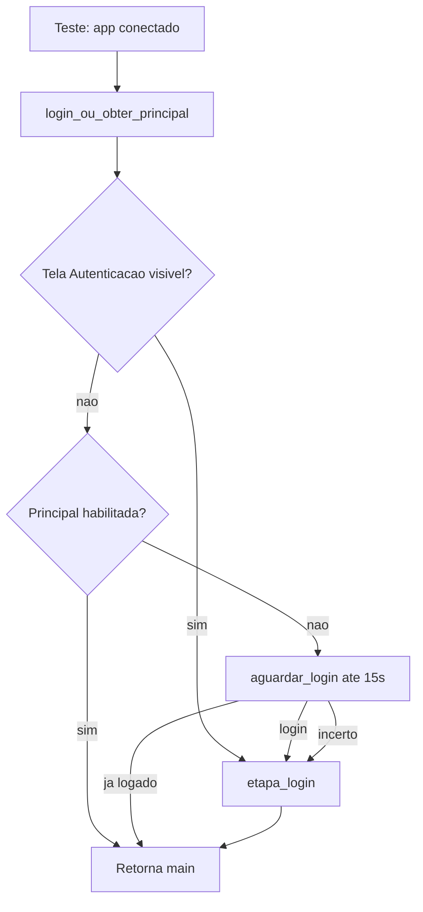

# Guia: login_flow e criação de testes do zero

Este documento descreve o módulo [`core/login_flow.py`](../core/login_flow.py), como ele se integra ao [`config.json`](../config.json) e o esqueleto para criar um fluxo novo na pasta `flows/`.

---

## Índice

1. [Visão geral](#visão-geral)
2. [Configuração (config.json)](#configuração-configjson)
3. [Funções do login_flow](#funções-do-login_flow)
4. [Fluxo de decisão (login vs já logado)](#fluxo-de-decisão-login-vs-já-logado)
5. [Como preencher o login (por dentro)](#como-preencher-o-login-por-dentro)
6. [Criar um teste novo do zero](#criar-um-teste-novo-do-zero)
7. [Módulos filhos (FCReceitas, FCProdutos…)](#módulos-filhos-fcreceitas-fcprodutos)
8. [Formas de executar](#formas-de-executar)
9. [Recorder e codegen](#recorder-e-codegen)
10. [O que evitar](#o-que-evitar)
11. [Logs esperados](#logs-esperados)
12. [Referências no projeto](#referências-no-projeto)

---

## Visão geral

| Responsabilidade | Onde fica |
|------------------|-----------|
| Credenciais e caminho do `.exe` | [`config.json`](../config.json) → [`core/config.py`](../core/config.py) (`LOGIN`, `SENHA`, `EXE_PATH`) |
| Detectar login vs janela principal | [`core/actions.py`](../core/actions.py) |
| Preencher login e retornar `main` | [`core/login_flow.py`](../core/login_flow.py) |
| Cliques, waits, screenshots | [`core/actions.py`](../core/actions.py) |

**Regra prática:** em quase todo teste, use apenas:

```python
main = login_ou_obter_principal(app, LOGIN, SENHA)
```

Não copie `etapa_login` manualmente em cada arquivo.

---

## Configuração (config.json)

Arquivo na raiz do projeto `V1`:

```json
{
  "exe_path": "C:\\Fcerta\\fcerta.exe",
  "login": "seu_usuario",
  "senha": "sua_senha"
}
```

Também é possível editar pela interface [`app.py`](../app.py) (aba Configurações).

No código Python:

```python
from core.config import LOGIN, SENHA, EXE_PATH
```

---

## Funções do login_flow

### `login_ou_obter_principal(app, usuario, senha)` — use esta

Função principal para testes e fluxos.

| Entrada | Descrição |
|---------|-----------|
| `app` | `Application` pywinauto (UIA) já conectada ou iniciada no `fcerta.exe` |
| `usuario` | Normalmente `LOGIN` |
| `senha` | Normalmente `SENHA` |

| Saída | Descrição |
|-------|-----------|
| `main` | Wrapper da janela principal **habilitada**, pronta para `type_keys`, menus, etc. |

Parâmetros opcionais:

- `timeout_principal=30` — espera da janela principal após login
- `timeout_aguardar_login=15` — espera da tela de login após abrir o app

---

### `etapa_login(app, usuario, senha)` — só o login

Use quando **já sabe** que a tela de autenticação está aberta e não precisa detectar “já logado”.

`realizar_login` é **alias** de `etapa_login` (compatibilidade).

---

### `obter_janela_principal(app)`

Retorna a principal habilitada ou `None`. Em geral não é necessário chamar direto.

---

## Fluxo de decisão (login vs já logado)



**Problema que isso corrige:** a janela `FórmulaCerta 6.0` (fundo) pode aparecer **enquanto** o diálogo de login ainda está aberto. Antes o sistema achava que já estava logado e falhava com `ElementNotEnabled` no menu.

---

## Como preencher o login (por dentro)

`etapa_login` tenta dois caminhos:

### 1. Campos UIA (preferencial, até 5s)

- Usuário: `TwwDBEdit`, `found_index=2` (AutoIt INSTANCE 3)
- Senha: `TwwDBEdit`, `found_index=3` (AutoIt INSTANCE 4)
- Enter em **cada campo** (`safe_press_keys`)

### 2. Fluxo na janela (fallback)

Se os edits não forem encontrados:

1. `safe_type(login, usuario)` + `{ENTER}`
2. `send_keys(senha)` no controle com foco (evita erro na janela pai)
3. `{ENTER}{ENTER}` na janela de login

Título esperado da janela: `FórmulaCerta Autenticação de Usuário` (`WIN_LOGIN` em `login_flow.py`).

---

## Criar um teste novo do zero

### Passo 1 — Estrutura de pastas

```text
V1/
  config.json
  core/
    login_flow.py
  flows/
    MeuModulo/
      CT-meu-teste.py
  docs/
    GUIA_LOGIN_E_NOVOS_TESTES.md
```

### Passo 2 — Esqueleto do arquivo

Crie `flows/MeuModulo/CT-meu-teste.py`:

```python
import sys
import time
from pathlib import Path
from pywinauto import Application
from loguru import logger

sys.path.insert(0, str(Path(__file__).parent.parent.parent))

from core.config import LOGIN, SENHA, EXE_PATH
from core.logging_setup import setup_logging
from core.login_flow import login_ou_obter_principal
from core.actions import (
    wait_element,
    wait_window,
    wait_app_by_exe,
    safe_click,
    safe_type,
    screenshot_on_failure,
)


def etapa_conectar_ou_iniciar() -> Application:
    try:
        app = Application(backend="uia").connect(path=EXE_PATH, timeout=3)
        logger.info("Conectado ao sistema ja aberto.")
        return app
    except Exception:
        logger.info("Iniciando Fcerta...")
        return Application(backend="uia").start(EXE_PATH)


def minha_etapa_de_negocio(main):
    main.set_focus()
    time.sleep(0.3)
    main.type_keys("%a")


def run():
    setup_logging(log_name="meu_teste", json_output=True)
    try:
        app = etapa_conectar_ou_iniciar()
        main = login_ou_obter_principal(app, LOGIN, SENHA)
        main.set_focus()
        minha_etapa_de_negocio(main)
        return 0
    except Exception as e:
        import traceback
        logger.error(f"FALHA: {e}")
        logger.error(traceback.format_exc())
        screenshot_on_failure("falha_meu_teste")
        return 1


if __name__ == "__main__":
    sys.exit(run())
```

### Passo 3 — Checklist

- [ ] `config.json` com `login`, `senha`, `exe_path`
- [ ] `sys.path` apontando para a raiz `V1`
- [ ] `etapa_conectar_ou_iniciar()` antes do login
- [ ] `login_ou_obter_principal(app, LOGIN, SENHA)`
- [ ] `if __name__ == "__main__": sys.exit(run())`

---

## Módulos filhos (FCReceitas, FCProdutos…)

```python
def etapa_no_modulo_receitas(main):
    app_receitas = wait_app_by_exe("FCReceitas.exe", timeout=20)
    tela = app_receitas.top_window()
    tela.set_focus()
```

Ver [`flows/Receitas/CT-168635.py`](../flows/Receitas/CT-168635.py).

---

## Formas de executar

```powershell
cd "c:\QA\teste automatizados\autotest\V1"
python flows/MeuModulo/CT-meu-teste.py
```

Com pytest: `pytest flows/Receitas/CT-168635.py` (após `pip install -r requirements.txt`).

---

## Recorder e codegen

`python app.py` → Recorder → exportar gera script com `login_ou_obter_principal(app, LOGIN, SENHA)`.

---

## O que evitar

| Evitar | Motivo |
|--------|--------|
| `etapa_login` duplicado em cada fluxo | Centralize em `login_flow` |
| `wait_window(..., r".*FórmulaCerta.*")` pós-login | Casa tela de Autenticação |
| Credenciais hardcoded no `.py` | Use `config.json` |

---

## Logs esperados

| Situação | Log |
|----------|-----|
| Login aberto | `Tela de login aberta — realizando autenticacao` |
| Já logado | `Sistema ja autenticado` |

`python test_login_flow.py` — testes sem app desktop.

---

## Referências

| Arquivo | Uso |
|---------|-----|
| `flows/Gravados/teste_gravado.py` | Exemplo mínimo |
| `flows/Receitas/CT-168635.py` | Fluxo completo |
| `core/login_flow.py` | Implementação |

---

## Resumo

**Conecte → `main = login_ou_obter_principal(app, LOGIN, SENHA)` → automatize em `main` ou `wait_app_by_exe`.**
